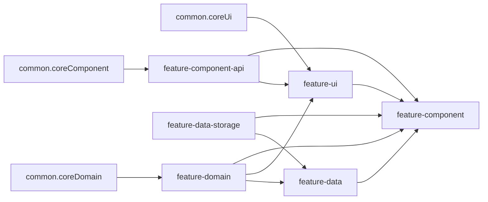

# Скелет KMP-фичи (SecurityChat)

Эталонная реализация: [features/settings](features/settings). Скилл не генерирует бизнес-логику и
UI — только структуру, зависимости и минимальные заготовки.

## Объём скелета (важно)

- **Делать:** шесть модулей фичи, `include` в [settings.gradle.kts](settings.gradle.kts), внутренняя
  структура слоёв, корневой компонент/экран внутри фичи по образцу `settings`.
- **Не делать:** не подключать навигацию в новую фичу из старых модулей — не трогать
  `MainComponent`, `ChatsComponent`, `MainScreen`, `RootComponent`, `shared` и т.п. ради входа в
  фичу. Связка приложения с фичей — отдельная задача, вне этого скелета.

## Именование

| Что                   | Формат                                                       | Пример                                      |
|-----------------------|--------------------------------------------------------------|---------------------------------------------|
| Путь Gradle / каталог | kebab-case                                                   | `features/settings/`                        |
| Type-safe accessor    | camelCase сегментов                                          | `projects.features.settings.settingsDomain` |
| `namespace` и пакеты  | `com.security.chat.multiplatform.features.<feature>.<layer>` | `...features.settings.domain`               |

Подфича в Gradle: `:features:<featureName>:<featureName>-<layer>` (например
`:features:settings:settings-ui`).

## Шесть модулей

| Модуль                 | Назначение                                                      | Типовые зависимости                                               |
|------------------------|-----------------------------------------------------------------|-------------------------------------------------------------------|
| `{name}-domain`        | Репозитории (интерфейсы), доменные сущности, `ScopedModel`      | `projects.common.coreDomain`                                      |
| `{name}-data`          | `RepoImpl`, мапперы data                                        | domain, data-storage, при необходимости другие фичи               |
| `{name}-data-storage`  | Хранилище, entity `*SM`, мапперы storage                        | `common.settings`, `core-component`, Koin, coroutines — по задаче |
| `{name}-ui`            | Compose, экраны, ViewModel, `viewModelOf`                       | `common.coreUi`, `component-api` (api), domain                    |
| `{name}-component-api` | Контракт корня Decompose + дочерние компоненты (`Child` sealed) | `common.coreComponent`                                            |
| `{name}-component`     | `SettingsComponentImpl`: стек, Koin load/unload                 | api, ui, domain, data, data-storage                               |

Эталонные
`build.gradle.kts`: [settings-domain](features/settings/settings-domain/build.gradle.kts), [settings-data](features/settings/settings-data/build.gradle.kts), [settings-data-storage](features/settings/settings-data-storage/build.gradle.kts), [settings-ui](features/settings/settings-ui/build.gradle.kts), [settings-component-api](features/settings/settings-component-api/build.gradle.kts), [settings-component](features/settings/settings-component/build.gradle.kts).

Плагин везде: `id("securitychat.convention.base")` и блок
`conventionBasePlugin { namespace = "..." }`.

## Граф зависимостей (логический)

## Конвенции для новых фич

- Интерфейсы дочерних Decompose-компонентов размещать в пакете **`...component.api`** (
  как [ThemeComponent.kt](features/settings/settings-component-api/src/commonMain/kotlin/com/security/chat/multiplatform/features/settings/component/api/ThemeComponent.kt)),
  а не смешивать с пакетом `ui.component` — в `settings` исторически встречаются оба варианта; для
  новых фич — единообразно `component.api`.
- **`kotlinxSerialization`**: подключать только в модулях, где нужна сериализация конфигурации
  навигации или payload (как
  в [settings-component/build.gradle.kts](features/settings/settings-component/build.gradle.kts) и
  при необходимости в data).
- Корневой компонент: константа `SCOPE_ID_<FEATURE>`, в `init` — `loadModules`, в `doOnDestroy` —
  `unloadModules` —
  см. [SettingsComponent.kt](features/settings/settings-component/src/commonMain/kotlin/com/security/chat/multiplatform/features/settings/component/SettingsComponent.kt).

## Чеклист скелета

1. Создать `features/<name>/` с шестью подпроектами; в каждом `build.gradle.kts` с корректным
   `namespace`.
2. Добавить `include(...)` в [settings.gradle.kts](settings.gradle.kts) (блок для
   `features:settings` — образец).
3. **domain**: интерфейс репозитория в `domain/repo/`, сущности в `domain/entity/`, `XxxModel` /
   `XxxModelImpl`,
   DI — [SettingsModel.kt](features/settings/settings-domain/src/commonMain/kotlin/com/security/chat/multiplatform/features/settings/domain/SettingsModel.kt), [SettingsDomainModule.kt](features/settings/settings-domain/src/commonMain/kotlin/com/security/chat/multiplatform/features/settings/domain/di/SettingsDomainModule.kt).
4. **data**: `RepoImpl`, при необходимости
   mapper, [SettingsDataModule.kt](features/settings/settings-data/src/commonMain/kotlin/com/security/chat/multiplatform/features/settings/data/di/SettingsDataModule.kt).
5. **data-storage** (если слой нужен): интерфейс +
   impl, [SettingsDataStorageModule.kt](features/settings/settings-data-storage/src/commonMain/kotlin/com/security/chat/multiplatform/features/settings/data/storage/di/SettingsDataStorageModule.kt).
6. **ui
   **: [SettingsUiModule.kt](features/settings/settings-ui/src/commonMain/kotlin/com/security/chat/multiplatform/features/settings/ui/di/SettingsUiModule.kt);
   корневой экран со
   стеком — [SettingsRootScreen.kt](features/settings/settings-ui/src/commonMain/kotlin/com/security/chat/multiplatform/features/settings/ui/screens/root/SettingsRootScreen.kt);
   для первого экрана — паттерн `State` / `Event` / `ViewModel` / `Screen` —
   каталог [screens/main/](features/settings/settings-ui/src/commonMain/kotlin/com/security/chat/multiplatform/features/settings/ui/screens/main/).
7. **component-api**: корневой интерфейс с
   `Child` — [SettingsComponent.kt](features/settings/settings-component-api/src/commonMain/kotlin/com/security/chat/multiplatform/features/settings/component/api/SettingsComponent.kt).
8. **component**: реализация с `childStack`, `@Serializable` sealed `Params`, фабрика
   детей — [SettingsComponent.kt](features/settings/settings-component/src/commonMain/kotlin/com/security/chat/multiplatform/features/settings/component/SettingsComponent.kt) (
   implementation class).

На этом скелет **заканчивается**. Шаги вроде `implementation` в `main-component`, `RootComponent`,
переходы из чатов — **не входят** в задачу «создать фичу по шаблону».

## Интеграция в приложение (вне скелета)

Когда понадобится реально открывать фичу из приложения, отдельно подключают зависимости и
навигацию (
например [shared/build.gradle.kts](shared/build.gradle.kts), [main-component](features/main/main-component/build.gradle.kts), [main-ui](features/main/main-ui/build.gradle.kts) —
по аналогии с settings). Для поиска мест: `rg "features\.<имя>"` в `*.gradle.kts` и Kotlin.

## Дополнительно

Полное дерево исходников эталона `features/settings` (только `.kt` /
`.kts`): [reference.md](reference.md).
