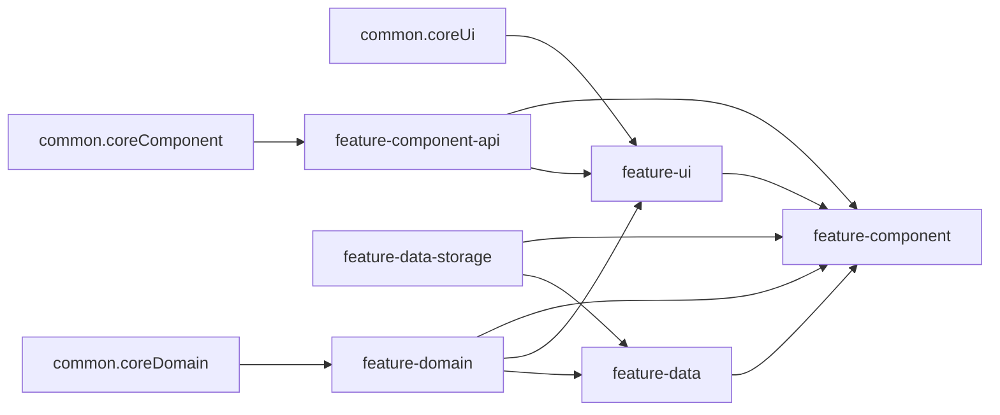

# KMP feature skeleton (SecurityChat)

Reference implementation: [features/settings](features/settings). The skill does not generate
business
logic or UI — only the structure, dependencies, and minimal stubs.

## Skeleton scope (important)

- **Do:** the six feature modules, the `include` in [settings.gradle.kts](settings.gradle.kts), the
  internal layer structure, and the feature's root component/screen modeled after `settings`.
- **Do not:** do not wire navigation into the new feature from existing modules — do not touch
  `MainComponent`, `ChatsComponent`, `MainScreen`, `RootComponent`, `shared`, etc. just to add an
  entry
  point into the feature. Connecting the app to the feature is a separate task, outside this
  skeleton.

## Naming

| What                     | Format                                                       | Example                                     |
|--------------------------|--------------------------------------------------------------|---------------------------------------------|
| Gradle path / folder     | kebab-case                                                   | `features/settings/`                        |
| Type-safe accessor       | camelCase segments                                           | `projects.features.settings.settingsDomain` |
| `namespace` and packages | `com.security.chat.multiplatform.features.<feature>.<layer>` | `...features.settings.domain`               |

Gradle subfeature: `:features:<featureName>:<featureName>-<layer>` (e.g.
`:features:settings:settings-ui`).

## Six modules

| Module                 | Purpose                                                     | Typical dependencies                                              |
|------------------------|-------------------------------------------------------------|-------------------------------------------------------------------|
| `{name}-domain`        | Repositories (interfaces), domain entities, `ScopedModel`   | `projects.common.coreDomain`                                      |
| `{name}-data`          | `RepoImpl`, data mappers                                    | domain, data-storage, other features when needed                  |
| `{name}-data-storage`  | Storage, `*SM` entities, storage mappers                    | `common.settings`, `core-component`, Koin, coroutines — as needed |
| `{name}-ui`            | Compose, screens, ViewModel, `viewModelOf`                  | `common.coreUi`, `component-api` (api), domain                    |
| `{name}-component-api` | Decompose root contract + child components (`Child` sealed) | `common.coreComponent`                                            |
| `{name}-component`     | `SettingsComponentImpl`: stack, Koin load/unload            | api, ui, domain, data, data-storage                               |

Reference
`build.gradle.kts`: [settings-domain](features/settings/settings-domain/build.gradle.kts), [settings-data](features/settings/settings-data/build.gradle.kts), [settings-data-storage](features/settings/settings-data-storage/build.gradle.kts), [settings-ui](features/settings/settings-ui/build.gradle.kts), [settings-component-api](features/settings/settings-component-api/build.gradle.kts), [settings-component](features/settings/settings-component/build.gradle.kts).

Plugin everywhere: `id("securitychat.convention.base")` and the
`conventionBasePlugin { namespace = "..." }` block.

## Dependency graph (logical)

```mermaid
flowchart LR
  coreDomain[common.coreDomain]
  coreUi[common.coreUi]
  coreComp[common.coreComponent]
  domain[feature-domain]
  storage[feature-data-storage]
  data[feature-data]
  ui[feature-ui]
  api[feature-component-api]
  comp[feature-component]
  coreDomain --> domain
  storage --> data
  domain --> data
  domain --> ui
  api --> ui
  coreUi --> ui
  coreComp --> api
  data --> comp
  domain --> comp
  ui --> comp
  storage --> comp
  api --> comp
```

## Conventions for new features

- Place child Decompose component interfaces in the **`...component.api`** package (like
  [ThemeComponent.kt](features/settings/settings-component-api/src/commonMain/kotlin/com/security/chat/multiplatform/features/settings/component/api/ThemeComponent.kt)),
  do not mix them with the `ui.component` package — in `settings` both variants appear historically;
  for
  new features, use `component.api` consistently.
- **`kotlinxSerialization`**: apply only in modules that need serialization of navigation config or
  payload (like
  in [settings-component/build.gradle.kts](features/settings/settings-component/build.gradle.kts)
  and
  in data when needed).
- Root component: a `SCOPE_ID_<FEATURE>` constant, `loadModules` in `init`, `unloadModules` in
  `doOnDestroy` —
  see [SettingsComponent.kt](features/settings/settings-component/src/commonMain/kotlin/com/security/chat/multiplatform/features/settings/component/SettingsComponent.kt).
- **DB access (SQLDelight-backed `{name}-data-storage`)**: keep a single `DatabaseCreator<T>`
  instance per database (never create more than one for the same DB — otherwise changes between DB
  instances do not sync). Obtain the DB via `dbCreator.getDb()` and wrap every read/write query
  execution in `withContext(dispatcherProvider.IO)`; expose reactive queries through
  `dbCreator.dbFlow` with `.flowOn(dispatcherProvider.IO)`. Reference:
  [ChatStorage.kt](features/chat/chat-data-storage/src/commonMain/kotlin/com/security/chat/multiplatform/features/chat/data/storage/ChatStorage.kt).

## Skeleton checklist

1. Create `features/<name>/` with six subprojects; each `build.gradle.kts` with the correct
   `namespace`.
2. Add `include(...)` to [settings.gradle.kts](settings.gradle.kts) (the block for
   `features:settings` is the template).
3. **domain**: repository interface in `domain/repo/`, entities in `domain/entity/`, `XxxModel` /
   `XxxModelImpl`,
   DI — [SettingsModel.kt](features/settings/settings-domain/src/commonMain/kotlin/com/security/chat/multiplatform/features/settings/domain/SettingsModel.kt), [SettingsDomainModule.kt](features/settings/settings-domain/src/commonMain/kotlin/com/security/chat/multiplatform/features/settings/domain/di/SettingsDomainModule.kt).
4. **data**: `RepoImpl`, a mapper when needed,
   [SettingsDataModule.kt](features/settings/settings-data/src/commonMain/kotlin/com/security/chat/multiplatform/features/settings/data/di/SettingsDataModule.kt).
5. **data-storage** (if the layer is needed): interface +
   impl, [SettingsDataStorageModule.kt](features/settings/settings-data-storage/src/commonMain/kotlin/com/security/chat/multiplatform/features/settings/data/storage/di/SettingsDataStorageModule.kt).
6. **ui
   **: [SettingsUiModule.kt](features/settings/settings-ui/src/commonMain/kotlin/com/security/chat/multiplatform/features/settings/ui/di/SettingsUiModule.kt);
   root screen with the
   stack — [SettingsRootScreen.kt](features/settings/settings-ui/src/commonMain/kotlin/com/security/chat/multiplatform/features/settings/ui/screens/root/SettingsRootScreen.kt);
   for the first screen — the `State` / `Event` / `ViewModel` / `Screen` pattern —
   directory [screens/main/](features/settings/settings-ui/src/commonMain/kotlin/com/security/chat/multiplatform/features/settings/ui/screens/main/).
   **Important**: When using `Screen(...) { state, vm -> ... }`, always provide the explicit type
   for the ViewModel parameter even if it's unused (e.g., `_ : MyViewModel`), otherwise Koin
   reification will fail with `NoDefinitionFoundException` for `BaseViewModel`.
7. **component-api**: root interface with
   `Child` — [SettingsComponent.kt](features/settings/settings-component-api/src/commonMain/kotlin/com/security/chat/multiplatform/features/settings/component/api/SettingsComponent.kt).
8. **component**: implementation with `childStack`, `@Serializable` sealed `Params`, child
   factory — [SettingsComponent.kt](features/settings/settings-component/src/commonMain/kotlin/com/security/chat/multiplatform/features/settings/component/SettingsComponent.kt) (
   implementation class).

This is where the skeleton **ends**. Steps such as `implementation` in `main-component`,
`RootComponent`, transitions from chats — are **not part** of the "create a feature from the
template"
task.

## App integration (outside the skeleton)

When you actually need to open the feature from the app, the dependencies and navigation are wired
separately (for
example [shared/build.gradle.kts](shared/build.gradle.kts), [main-component](features/main/main-component/build.gradle.kts), [main-ui](features/main/main-ui/build.gradle.kts) —
by analogy with settings). To find the places: `rg "features\.<name>"` in `*.gradle.kts` and Kotlin.

## Additional

Full source tree of the `features/settings` reference (only `.kt` /
`.kts`): [reference.md](reference.md).
